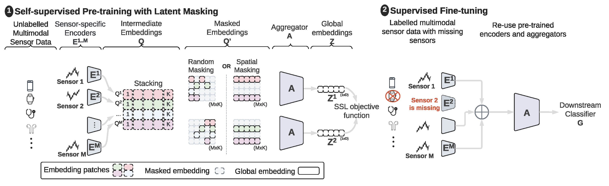

# CroSSL
[WSDM'24] CroSSL: Cross-modal Self-Supervised Learning for Time-series through Latent Masking

**• Paper**: https://arxiv.org/abs/2307.16847

**• Abstract**:

Limited availability of labeled data for machine learning on multimodal time-series extensively hampers progress in the field. Self-supervised learning (SSL) is a promising approach to learning data representations without relying on labels. However, existing SSL methods require expensive computations of negative pairs and are typically designed for single modalities, which limits their versatility. We introduce CroSSL (Cross-modal SSL), which puts forward two novel concepts: masking intermediate embeddings produced by modality-specific encoders, and their aggregation into a global embedding through a cross-modal aggregator that can be fed to down-stream classifiers. CroSSL allows for handling missing modalities and end-to-end cross-modal learning without requiring prior data preprocessing for handling missing inputs or negative-pair sampling for contrastive learning. We evaluate our method on a wide range of data, including motion sensors such as accelerometers or gyroscopes and biosignals (heart rate, electroencephalograms, electromyograms, electrooculograms, and electrodermal) to investigate the impact of masking ratios and masking strategies for various data types and the robustness of the learned representations to missing data. Overall, CroSSL outperforms previous SSL and supervised benchmarks using minimal labeled data, and also sheds light on how latent masking can improve cross-modal learning.

<div style="text-align:center;">
    
    <p style="text-align:center;">Figure 1- CroSSL Framework Overview</p>
</div>


<div style="text-align:center;">
    
    <p>Figure 2- Loss Function</p>
</div>

# How to Run Experiments

Set up the arguments of your desired experiment in `exp_setup.py` and then run
```
> python main.py 
```


# Citation
Please use:
```bibtex
@inproceedings{deldari2023latent,
  title={Latent Masking for Multimodal Self-supervised Learning in Health Timeseries},
  author={Deldari, Shohreh and Spathis, Dimitris and Malekzadeh, Mohammad and Kawsar, Fahim and Salim, Flora and Mathur, Akhil},
  journal={Proceedings of The 17th ACM International Conference on Web Search and Data Mining (WSDM'24)},
  year={2024}
}

```